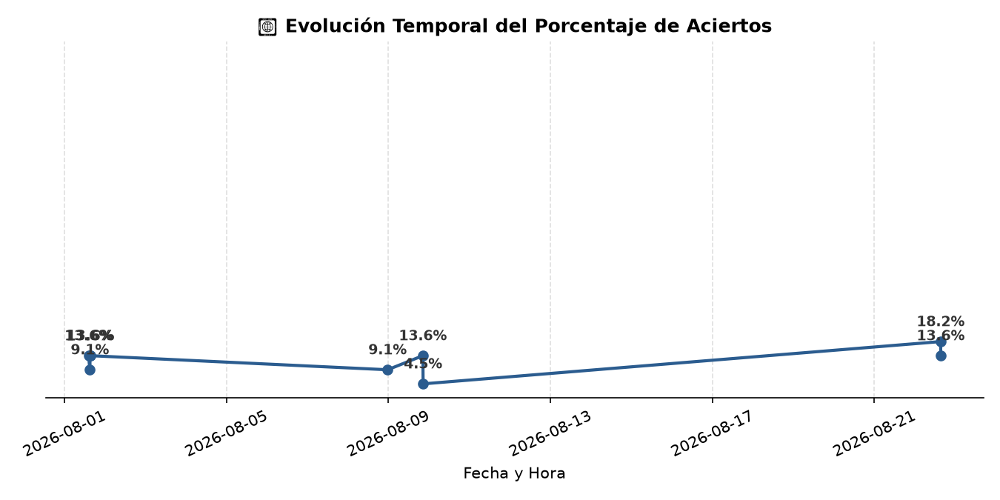

# 📊 Reporte Histórico de Evaluaciones (Evals)

Última actualización: `2026-08-22 15:17:00`

## 📈 Tendencia de Precisión

---

## 📝 Historial de Ejecuciones Acumuladas

| fecha               | provedor   | modelo                | system_promt   |   latencia_promedio |   casos |   aciertos |   sin_respuesta |   mal_formadas | precision   | p_sin_respuesta   | p_mal_formadas   |
|:--------------------|:-----------|:----------------------|:---------------|--------------------:|--------:|-----------:|----------------:|---------------:|:------------|:------------------|:-----------------|
| 2026-08-01 14:17:00 | GEMINI     | gemini-3.1-flash-lite | ZERO SHOTS     |             1.58801 |      22 |          3 |               9 |             10 | 13.6%       | 40.9%             | 45.5%            |
| 2026-08-01 15:06:00 | OPENAI     | gpt-4o-mini           | ZERO SHOTS     |             2.019   |      22 |          2 |               1 |             19 | 9.1%        | 4.5%              | 86.4%            |
| 2026-08-01 15:11:00 | GEMINI     | gemini-3.1-flash-lite | FEW SHOTS      |             1.84704 |      22 |          3 |              10 |              9 | 13.6%       | 45.5%             | 40.9%            |
| 2026-08-01 15:21:00 | GEMINI     | gemini-3.1-flash-lite | ZERO SHOTS     |             1.3064  |      22 |          3 |               9 |             10 | 13.6%       | 40.9%             | 45.5%            |
| 2026-08-08 23:30:00 | GEMINI     | gemini-3.1-flash-lite | ZERO SHOTS     |           468.496   |      22 |          2 |              15 |              5 | 9.1%        | 68.2%             | 22.7%            |
| 2026-08-09 20:25:00 | GEMINI     | gemini-3.1-flash-lite | ZERO SHOTS     |          1435.02    |      22 |          3 |               9 |             10 | 13.6%       | 40.9%             | 45.5%            |
| 2026-08-09 20:33:00 | OPENAI     | gpt-4o-mini           | ZERO SHOTS     |          2533.39    |      22 |          1 |               0 |             21 | 4.5%        | 0.0%              | 95.5%            |
| 2026-08-22 15:15:00 | GEMINI     | gemini-3.1-flash-lite | ZERO SHOTS     |          8941.19    |      22 |          4 |               8 |             10 | 18.2%       | 36.4%             | 45.5%            |
| 2026-08-22 15:17:00 | OPENAI     | gpt-4o-mini           | ZERO SHOTS     |          2647.75    |      22 |          3 |               0 |             19 | 13.6%       | 0.0%              | 86.4%            |
