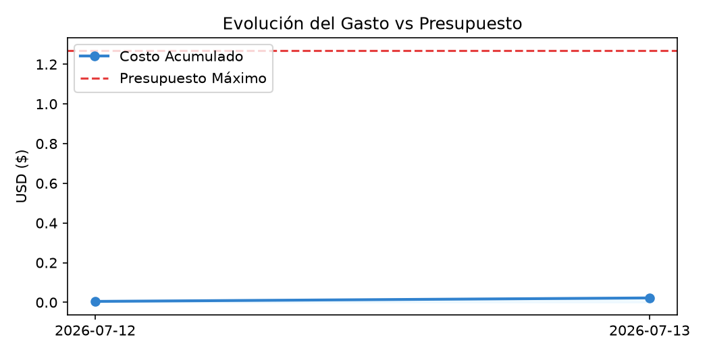

# Reporte Ejecutivo de Tokenomics y Telemetría
**Fecha de generación:** 13/07/2026 10:59

## Resumen General de Consumo

| Métrica de Control | Valor Acumulado |
| :--- | :--- |
| **Presupuesto Máximo Asignado** | $1.2700 USD |
| **Costo Financiero Incurrido** | $0.0223 USD |
| **Presupuesto Restante** | $1.2477 USD |
| Tokens Totales Consumidos | 89,007 tokens |
| Latencia Promedio de API | 0.000 ms |

## Monitoreo Visual del Presupuesto

## Anexo: Historial de Llamadas Detallado

|    | fecha      | hora   | provider   | model                 |   input_tokens |   thinking_tokens |   output_tokens | costo_total   | costo_acumulado   |
|---:|:-----------|:-------|:-----------|:----------------------|---------------:|------------------:|----------------:|:--------------|:------------------|
|  0 | 2026-07-12 | 19:55  | GEMINI     | gemini-3.1-flash-lite |          1,695 |                 0 |              16 | $0.00043      | $0.00043          |
|  1 | 2026-07-12 | 19:57  | GEMINI     | gemini-3.1-flash-lite |          1,695 |                 0 |              16 | $0.00043      | $0.00086          |
|  2 | 2026-07-12 | 19:59  | GEMINI     | gemini-3.1-flash-lite |          1,695 |                 0 |              16 | $0.00043      | $0.00128          |
|  3 | 2026-07-12 | 20:01  | GEMINI     | gemini-3.1-flash-lite |          1,695 |                 0 |              16 | $0.00043      | $0.00171          |
|  4 | 2026-07-12 | 20:04  | GEMINI     | gemini-3.1-flash-lite |          1,695 |                 0 |              16 | $0.00043      | $0.00214          |
|  5 | 2026-07-12 | 20:13  | GEMINI     | gemini-3.1-flash-lite |          1,695 |                 0 |              16 | $0.00043      | $0.00257          |
|  6 | 2026-07-12 | 20:17  | GEMINI     | gemini-3.1-flash-lite |          1,695 |                 0 |              16 | $0.00043      | $0.00299          |
|  7 | 2026-07-12 | 20:34  | GEMINI     | gemini-3.1-flash-lite |          1,708 |                 0 |             119 | $0.00046      | $0.00345          |
|  8 | 2026-07-12 | 20:40  | GEMINI     | gemini-3.1-flash-lite |          1,731 |                 0 |             122 | $0.00046      | $0.00391          |
|  9 | 2026-07-12 | 20:45  | GEMINI     | gemini-3.1-flash-lite |          1,731 |                 0 |             121 | $0.00046      | $0.00438          |
| 10 | 2026-07-12 | 21:10  | GEMINI     | gemini-3.1-flash-lite |          1,731 |                 0 |             124 | $0.00046      | $0.00484          |
| 11 | 2026-07-13 | 00:40  | GEMINI     | gemini-3.1-flash-lite |          1,731 |                 0 |             121 | $0.00046      | $0.00530          |
| 12 | 2026-07-13 | 00:40  | GEMINI     | gemini-3.1-flash-lite |          1,721 |                 0 |             213 | $0.00048      | $0.00579          |
| 13 | 2026-07-13 | 00:41  | GEMINI     | gemini-3.1-flash-lite |          1,722 |                 0 |             169 | $0.00047      | $0.00626          |
| 14 | 2026-07-13 | 00:41  | GEMINI     | gemini-3.1-flash-lite |          1,719 |                 0 |             122 | $0.00046      | $0.00672          |
| 15 | 2026-07-13 | 00:41  | GEMINI     | gemini-3.1-flash-lite |          1,724 |                 0 |             181 | $0.00048      | $0.00720          |
| 16 | 2026-07-13 | 00:54  | GEMINI     | gemini-3.1-flash-lite |          1,731 |                 0 |             124 | $0.00046      | $0.00766          |
| 17 | 2026-07-13 | 00:54  | GEMINI     | gemini-3.1-flash-lite |          1,721 |                 0 |             213 | $0.00048      | $0.00814          |
| 18 | 2026-07-13 | 00:57  | GEMINI     | gemini-3.1-flash-lite |          1,731 |                 0 |             121 | $0.00046      | $0.00861          |
| 19 | 2026-07-13 | 00:59  | GEMINI     | gemini-3.1-flash-lite |          1,731 |                 0 |             123 | $0.00046      | $0.00907          |
| 20 | 2026-07-13 | 01:01  | GEMINI     | gemini-3.1-flash-lite |          1,721 |                 0 |             213 | $0.00048      | $0.00955          |
| 21 | 2026-07-13 | 01:02  | GEMINI     | gemini-3.1-flash-lite |          1,731 |                 0 |             121 | $0.00046      | $0.01002          |
| 22 | 2026-07-13 | 01:04  | GEMINI     | gemini-3.1-flash-lite |          1,731 |                 0 |             121 | $0.00046      | $0.01048          |
| 23 | 2026-07-13 | 01:06  | GEMINI     | gemini-3.1-flash-lite |          1,731 |                 0 |             121 | $0.00046      | $0.01094          |
| 24 | 2026-07-13 | 01:07  | GEMINI     | gemini-3.1-flash-lite |          1,731 |                 0 |             121 | $0.00046      | $0.01141          |
| 25 | 2026-07-13 | 01:07  | GEMINI     | gemini-3.1-flash-lite |          1,721 |                 0 |             213 | $0.00048      | $0.01189          |
| 26 | 2026-07-13 | 01:07  | GEMINI     | gemini-3.1-flash-lite |          1,722 |                 0 |             171 | $0.00047      | $0.01236          |
| 27 | 2026-07-13 | 01:07  | GEMINI     | gemini-3.1-flash-lite |          1,719 |                 0 |             122 | $0.00046      | $0.01282          |
| 28 | 2026-07-13 | 10:18  | GEMINI     | gemini-3.1-flash-lite |          1,731 |                 0 |             121 | $0.00046      | $0.01329          |
| 29 | 2026-07-13 | 10:19  | GEMINI     | gemini-3.1-flash-lite |          1,721 |                 0 |             213 | $0.00048      | $0.01377          |
| 30 | 2026-07-13 | 10:19  | GEMINI     | gemini-3.1-flash-lite |          1,722 |                 0 |             171 | $0.00047      | $0.01424          |
| 31 | 2026-07-13 | 10:19  | GEMINI     | gemini-3.1-flash-lite |          1,719 |                 0 |             122 | $0.00046      | $0.01470          |
| 32 | 2026-07-13 | 10:19  | GEMINI     | gemini-3.1-flash-lite |          1,724 |                 0 |             186 | $0.00048      | $0.01518          |
| 33 | 2026-07-13 | 10:52  | GEMINI     | gemini-3.1-flash-lite |          1,731 |                 0 |             121 | $0.00046      | $0.01564          |
| 34 | 2026-07-13 | 10:52  | GEMINI     | gemini-3.1-flash-lite |          1,721 |                 0 |             213 | $0.00048      | $0.01613          |
| 35 | 2026-07-13 | 10:52  | GEMINI     | gemini-3.1-flash-lite |          1,722 |                 0 |             167 | $0.00047      | $0.01660          |
| 36 | 2026-07-13 | 10:52  | GEMINI     | gemini-3.1-flash-lite |          1,719 |                 0 |             122 | $0.00046      | $0.01706          |
| 37 | 2026-07-13 | 10:52  | GEMINI     | gemini-3.1-flash-lite |          1,724 |                 0 |             201 | $0.00048      | $0.01754          |
| 38 | 2026-07-13 | 10:57  | GEMINI     | gemini-3.1-flash-lite |          1,731 |                 0 |             123 | $0.00046      | $0.01800          |
| 39 | 2026-07-13 | 10:57  | GEMINI     | gemini-3.1-flash-lite |          1,721 |                 0 |             211 | $0.00048      | $0.01849          |
| 40 | 2026-07-13 | 10:57  | GEMINI     | gemini-3.1-flash-lite |          1,722 |                 0 |             166 | $0.00047      | $0.01896          |
| 41 | 2026-07-13 | 10:57  | GEMINI     | gemini-3.1-flash-lite |          1,719 |                 0 |             122 | $0.00046      | $0.01942          |
| 42 | 2026-07-13 | 10:57  | GEMINI     | gemini-3.1-flash-lite |          1,724 |                 0 |             178 | $0.00048      | $0.01989          |
| 43 | 2026-07-13 | 10:59  | GEMINI     | gemini-3.1-flash-lite |          1,731 |                 0 |             128 | $0.00046      | $0.02036          |
| 44 | 2026-07-13 | 10:59  | GEMINI     | gemini-3.1-flash-lite |          1,721 |                 0 |             213 | $0.00048      | $0.02084          |
| 45 | 2026-07-13 | 10:59  | GEMINI     | gemini-3.1-flash-lite |          1,722 |                 0 |             169 | $0.00047      | $0.02132          |
| 46 | 2026-07-13 | 10:59  | GEMINI     | gemini-3.1-flash-lite |          1,719 |                 0 |             122 | $0.00046      | $0.02178          |
| 47 | 2026-07-13 | 10:59  | GEMINI     | gemini-3.1-flash-lite |          1,724 |                 0 |             178 | $0.00048      | $0.02225          |