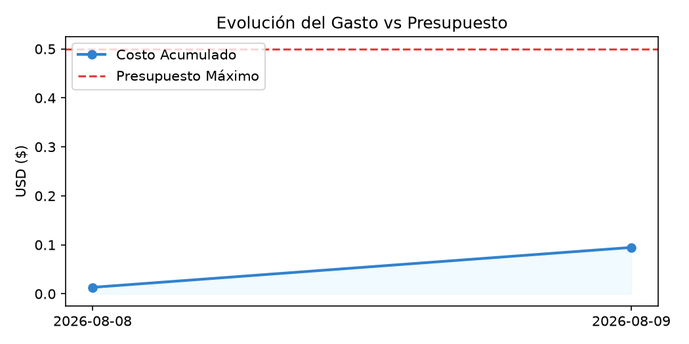

# Reporte Ejecutivo de Tokenomics y Telemetría
**Fecha de generación:** 29/07/2026 14:48

## Resumen General de Consumo

| Métrica de Control | Valor Acumulado |
| :--- | :--- |
| **Presupuesto Máximo Asignado** | $1.2700 USD |
| **Costo Financiero Incurrido** | $0.0364 USD |
| **Presupuesto Restante** | $1.2336 USD |
| Tokens Totales Consumidos | 160,639 tokens |
| Latencia Promedio de API | 0.000 ms |

## Monitoreo Visual del Presupuesto

## Anexo: Historial de Llamadas Detallado

|    | fecha      | hora   | provider   | model                 |   input_tokens |   thinking_tokens |   output_tokens | costo_total   | costo_acumulado   |
|---:|:-----------|:-------|:-----------|:----------------------|---------------:|------------------:|----------------:|:--------------|:------------------|
|  0 | 2026-07-12 | 19:55  | GEMINI     | gemini-3.1-flash-lite |          1,695 |                 0 |              16 | $0.00043      | $0.00043          |
|  1 | 2026-07-12 | 19:57  | GEMINI     | gemini-3.1-flash-lite |          1,695 |                 0 |              16 | $0.00043      | $0.00086          |
|  2 | 2026-07-12 | 19:59  | GEMINI     | gemini-3.1-flash-lite |          1,695 |                 0 |              16 | $0.00043      | $0.00128          |
|  3 | 2026-07-12 | 20:01  | GEMINI     | gemini-3.1-flash-lite |          1,695 |                 0 |              16 | $0.00043      | $0.00171          |
|  4 | 2026-07-12 | 20:04  | GEMINI     | gemini-3.1-flash-lite |          1,695 |                 0 |              16 | $0.00043      | $0.00214          |
|  5 | 2026-07-12 | 20:13  | GEMINI     | gemini-3.1-flash-lite |          1,695 |                 0 |              16 | $0.00043      | $0.00257          |
|  6 | 2026-07-12 | 20:17  | GEMINI     | gemini-3.1-flash-lite |          1,695 |                 0 |              16 | $0.00043      | $0.00299          |
|  7 | 2026-07-12 | 20:34  | GEMINI     | gemini-3.1-flash-lite |          1,708 |                 0 |             119 | $0.00046      | $0.00345          |
|  8 | 2026-07-12 | 20:40  | GEMINI     | gemini-3.1-flash-lite |          1,731 |                 0 |             122 | $0.00046      | $0.00391          |
|  9 | 2026-07-12 | 20:45  | GEMINI     | gemini-3.1-flash-lite |          1,731 |                 0 |             121 | $0.00046      | $0.00438          |
| 10 | 2026-07-12 | 21:10  | GEMINI     | gemini-3.1-flash-lite |          1,731 |                 0 |             124 | $0.00046      | $0.00484          |
| 11 | 2026-07-13 | 00:40  | GEMINI     | gemini-3.1-flash-lite |          1,731 |                 0 |             121 | $0.00046      | $0.00530          |
| 12 | 2026-07-13 | 00:40  | GEMINI     | gemini-3.1-flash-lite |          1,721 |                 0 |             213 | $0.00048      | $0.00579          |
| 13 | 2026-07-13 | 00:41  | GEMINI     | gemini-3.1-flash-lite |          1,722 |                 0 |             169 | $0.00047      | $0.00626          |
| 14 | 2026-07-13 | 00:41  | GEMINI     | gemini-3.1-flash-lite |          1,719 |                 0 |             122 | $0.00046      | $0.00672          |
| 15 | 2026-07-13 | 00:41  | GEMINI     | gemini-3.1-flash-lite |          1,724 |                 0 |             181 | $0.00048      | $0.00720          |
| 16 | 2026-07-13 | 00:54  | GEMINI     | gemini-3.1-flash-lite |          1,731 |                 0 |             124 | $0.00046      | $0.00766          |
| 17 | 2026-07-13 | 00:54  | GEMINI     | gemini-3.1-flash-lite |          1,721 |                 0 |             213 | $0.00048      | $0.00814          |
| 18 | 2026-07-13 | 00:57  | GEMINI     | gemini-3.1-flash-lite |          1,731 |                 0 |             121 | $0.00046      | $0.00861          |
| 19 | 2026-07-13 | 00:59  | GEMINI     | gemini-3.1-flash-lite |          1,731 |                 0 |             123 | $0.00046      | $0.00907          |
| 20 | 2026-07-13 | 01:01  | GEMINI     | gemini-3.1-flash-lite |          1,721 |                 0 |             213 | $0.00048      | $0.00955          |
| 21 | 2026-07-13 | 01:02  | GEMINI     | gemini-3.1-flash-lite |          1,731 |                 0 |             121 | $0.00046      | $0.01002          |
| 22 | 2026-07-13 | 01:04  | GEMINI     | gemini-3.1-flash-lite |          1,731 |                 0 |             121 | $0.00046      | $0.01048          |
| 23 | 2026-07-13 | 01:06  | GEMINI     | gemini-3.1-flash-lite |          1,731 |                 0 |             121 | $0.00046      | $0.01094          |
| 24 | 2026-07-13 | 01:07  | GEMINI     | gemini-3.1-flash-lite |          1,731 |                 0 |             121 | $0.00046      | $0.01141          |
| 25 | 2026-07-13 | 01:07  | GEMINI     | gemini-3.1-flash-lite |          1,721 |                 0 |             213 | $0.00048      | $0.01189          |
| 26 | 2026-07-13 | 01:07  | GEMINI     | gemini-3.1-flash-lite |          1,722 |                 0 |             171 | $0.00047      | $0.01236          |
| 27 | 2026-07-13 | 01:07  | GEMINI     | gemini-3.1-flash-lite |          1,719 |                 0 |             122 | $0.00046      | $0.01282          |
| 28 | 2026-07-13 | 10:18  | GEMINI     | gemini-3.1-flash-lite |          1,731 |                 0 |             121 | $0.00046      | $0.01329          |
| 29 | 2026-07-13 | 10:19  | GEMINI     | gemini-3.1-flash-lite |          1,721 |                 0 |             213 | $0.00048      | $0.01377          |
| 30 | 2026-07-13 | 10:19  | GEMINI     | gemini-3.1-flash-lite |          1,722 |                 0 |             171 | $0.00047      | $0.01424          |
| 31 | 2026-07-13 | 10:19  | GEMINI     | gemini-3.1-flash-lite |          1,719 |                 0 |             122 | $0.00046      | $0.01470          |
| 32 | 2026-07-13 | 10:19  | GEMINI     | gemini-3.1-flash-lite |          1,724 |                 0 |             186 | $0.00048      | $0.01518          |
| 33 | 2026-07-13 | 10:52  | GEMINI     | gemini-3.1-flash-lite |          1,731 |                 0 |             121 | $0.00046      | $0.01564          |
| 34 | 2026-07-13 | 10:52  | GEMINI     | gemini-3.1-flash-lite |          1,721 |                 0 |             213 | $0.00048      | $0.01613          |
| 35 | 2026-07-13 | 10:52  | GEMINI     | gemini-3.1-flash-lite |          1,722 |                 0 |             167 | $0.00047      | $0.01660          |
| 36 | 2026-07-13 | 10:52  | GEMINI     | gemini-3.1-flash-lite |          1,719 |                 0 |             122 | $0.00046      | $0.01706          |
| 37 | 2026-07-13 | 10:52  | GEMINI     | gemini-3.1-flash-lite |          1,724 |                 0 |             201 | $0.00048      | $0.01754          |
| 38 | 2026-07-13 | 10:57  | GEMINI     | gemini-3.1-flash-lite |          1,731 |                 0 |             123 | $0.00046      | $0.01800          |
| 39 | 2026-07-13 | 10:57  | GEMINI     | gemini-3.1-flash-lite |          1,721 |                 0 |             211 | $0.00048      | $0.01849          |
| 40 | 2026-07-13 | 10:57  | GEMINI     | gemini-3.1-flash-lite |          1,722 |                 0 |             166 | $0.00047      | $0.01896          |
| 41 | 2026-07-13 | 10:57  | GEMINI     | gemini-3.1-flash-lite |          1,719 |                 0 |             122 | $0.00046      | $0.01942          |
| 42 | 2026-07-13 | 10:57  | GEMINI     | gemini-3.1-flash-lite |          1,724 |                 0 |             178 | $0.00048      | $0.01989          |
| 43 | 2026-07-13 | 10:59  | GEMINI     | gemini-3.1-flash-lite |          1,731 |                 0 |             128 | $0.00046      | $0.02036          |
| 44 | 2026-07-13 | 10:59  | GEMINI     | gemini-3.1-flash-lite |          1,721 |                 0 |             213 | $0.00048      | $0.02084          |
| 45 | 2026-07-13 | 10:59  | GEMINI     | gemini-3.1-flash-lite |          1,722 |                 0 |             169 | $0.00047      | $0.02132          |
| 46 | 2026-07-13 | 10:59  | GEMINI     | gemini-3.1-flash-lite |          1,719 |                 0 |             122 | $0.00046      | $0.02178          |
| 47 | 2026-07-13 | 10:59  | GEMINI     | gemini-3.1-flash-lite |          1,724 |                 0 |             178 | $0.00048      | $0.02225          |
| 48 | 2026-07-29 | 12:45  | GEMINI     | gemini-3.1-flash-lite |          2,220 |                 0 |             115 | $0.00058      | $0.02284          |
| 49 | 2026-07-29 | 12:53  | GEMINI     | gemini-3.1-flash-lite |          2,219 |                 0 |             115 | $0.00058      | $0.02342          |
| 50 | 2026-07-29 | 13:00  | GEMINI     | gemini-3.1-flash-lite |          2,219 |                 0 |             115 | $0.00058      | $0.02400          |
| 51 | 2026-07-29 | 13:03  | GEMINI     | gemini-3.1-flash-lite |          2,219 |                 0 |             115 | $0.00058      | $0.02459          |
| 52 | 2026-07-29 | 13:33  | OPENAI     | gpt-4o-mini           |          2,462 |                 0 |             107 | $0.00039      | $0.02497          |
| 53 | 2026-07-29 | 13:33  | OPENAI     | gpt-4o-mini           |          2,452 |                 0 |             168 | $0.00039      | $0.02536          |
| 54 | 2026-07-29 | 13:34  | OPENAI     | gpt-4o-mini           |          2,452 |                 0 |             122 | $0.00039      | $0.02575          |
| 55 | 2026-07-29 | 13:34  | OPENAI     | gpt-4o-mini           |          2,449 |                 0 |              77 | $0.00038      | $0.02613          |
| 56 | 2026-07-29 | 13:34  | OPENAI     | gpt-4o-mini           |          2,454 |                 0 |              72 | $0.00038      | $0.02651          |
| 57 | 2026-07-29 | 13:35  | OPENAI     | gpt-4o-mini           |          2,452 |                 0 |              65 | $0.00038      | $0.02689          |
| 58 | 2026-07-29 | 14:12  | OPENAI     | gpt-4o-mini           |          2,151 |                 0 |             192 | $0.00035      | $0.02724          |
| 59 | 2026-07-29 | 14:12  | OPENAI     | gpt-4o-mini           |          2,141 |                 0 |             191 | $0.00035      | $0.02759          |
| 60 | 2026-07-29 | 14:13  | OPENAI     | gpt-4o-mini           |          2,141 |                 0 |             125 | $0.00034      | $0.02793          |
| 61 | 2026-07-29 | 14:13  | OPENAI     | gpt-4o-mini           |          2,138 |                 0 |              72 | $0.00033      | $0.02826          |
| 62 | 2026-07-29 | 14:13  | OPENAI     | gpt-4o-mini           |          2,143 |                 0 |             116 | $0.00034      | $0.02860          |
| 63 | 2026-07-29 | 14:15  | OPENAI     | gpt-4o-mini           |          2,141 |                 0 |              84 | $0.00033      | $0.02893          |
| 64 | 2026-07-29 | 14:23  | OPENAI     | gpt-4o-mini           |          2,151 |                 0 |             112 | $0.00034      | $0.02927          |
| 65 | 2026-07-29 | 14:24  | OPENAI     | gpt-4o-mini           |          2,141 |                 0 |             167 | $0.00035      | $0.02962          |
| 66 | 2026-07-29 | 14:32  | OPENAI     | gpt-4o-mini           |          2,151 |                 0 |             115 | $0.00034      | $0.02996          |
| 67 | 2026-07-29 | 14:33  | OPENAI     | gpt-4o-mini           |          2,151 |                 0 |             107 | $0.00034      | $0.03030          |
| 68 | 2026-07-29 | 14:35  | GEMINI     | gemini-3.1-flash-lite |          1,876 |                 0 |             115 | $0.00050      | $0.03079          |
| 69 | 2026-07-29 | 14:36  | GEMINI     | gemini-3.1-flash-lite |          1,954 |                 0 |             118 | $0.00052      | $0.03131          |
| 70 | 2026-07-29 | 14:36  | GEMINI     | gemini-3.1-flash-lite |          1,866 |                 0 |             166 | $0.00051      | $0.03182          |
| 71 | 2026-07-29 | 14:43  | GEMINI     | gemini-3.1-flash-lite |          1,876 |                 0 |             115 | $0.00050      | $0.03232          |
| 72 | 2026-07-29 | 14:44  | GEMINI     | gemini-3.1-flash-lite |          1,954 |                 0 |             118 | $0.00052      | $0.03283          |
| 73 | 2026-07-29 | 14:47  | GEMINI     | gemini-3.1-flash-lite |          1,876 |                 0 |             115 | $0.00050      | $0.03333          |
| 74 | 2026-07-29 | 14:47  | GEMINI     | gemini-3.1-flash-lite |          1,954 |                 0 |             115 | $0.00052      | $0.03385          |
| 75 | 2026-07-29 | 14:47  | GEMINI     | gemini-3.1-flash-lite |          1,866 |                 0 |             166 | $0.00051      | $0.03436          |
| 76 | 2026-07-29 | 14:47  | GEMINI     | gemini-3.1-flash-lite |          1,867 |                 0 |             169 | $0.00051      | $0.03487          |
| 77 | 2026-07-29 | 14:47  | GEMINI     | gemini-3.1-flash-lite |          1,864 |                 0 |              86 | $0.00049      | $0.03535          |
| 78 | 2026-07-29 | 14:47  | GEMINI     | gemini-3.1-flash-lite |          1,869 |                 0 |             165 | $0.00051      | $0.03586          |
| 79 | 2026-07-29 | 14:47  | GEMINI     | gemini-3.1-flash-lite |          1,866 |                 0 |              97 | $0.00049      | $0.03635          |